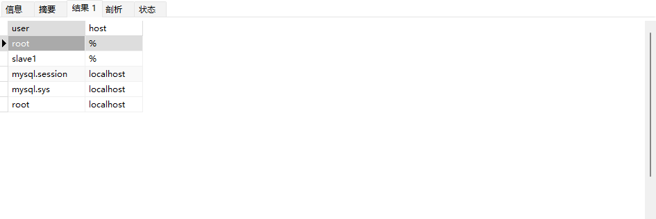

# 1. Linux

## 1.1 虚拟机

### 1. ip不显示


1. 去服务那里看看vmvare的网络服务有没有启动，如果没有则启动

2. 检查网络配置

   位置：/etc/sysconfig/network-scripts/ifcfg-ens33

   

   刷新：systemctl restart network //不行就重启虚拟机

3. 如果想要设置静态ip，需在配置文件中加上内容

   

成功后：


> 重启没用试试用shutdown -h now关机再启动

### 2. 虚拟机开启时win11电脑休眠会关机

1. 虚拟机挂起时也会出现同样的问题
2. 虚拟机挂起且关闭vmvare也会出现同样的问题
3. 虚拟机关机且关闭vmvare也会出现同样的问题

查看win启动日志，有两条错误信息


搜索解决方法：https://blog.csdn.net/weixin_43996457/article/details/124320718


> 我原来的vmvare版本是15.5，可能与win11有冲突，**升级到15.5.7后问题完美解决，虚拟机直接开启在休眠状态下也能直接恢复**


## 1.2 服务器

### 1.2.1 数据库被删除

数据库被删除


初步估计数据库密码太简单了，更改强度更高的密码

### 1.2.2 Navicat通过常规连接连接不上


- 切换为使用SSH连接服务器，用户名和密码为服务器的用户名密码
- 不要用校园网，用其他网就行

### 1.2.3 远程连接断开之后开启的服务也会自动停止

使用nohup命令```nohup systemctl start mysqld &```

具体可参考这篇文章：https://blog.csdn.net/helloworld0906/article/details/97108950

### 1.2.4 数据库修改密码

可参考：https://blog.csdn.net/qq_40757240/article/details/118068317

```mysql
set global validate_password_policy=strong; #设置安全等级
alter user 'root'@'localhost' identified by '******'; #修改密码，常用大小写数字符号非连续相等字符
```

### 1.2.5 从库连不上主库

error connecting to master 'slave1@116.62.105.54:3306' - retry-time: 60  retries: 1


1. 重新授权 grant replication slave on *.* to 'slave1'@'%'identified by'slave@test01';仍然不行

2. 查找log-error=/var/log/mysqld.log 显示：

   

   查找用户：select user, host from mysql.user; 没有新授权的用户，改用原来的用户和密码（并且切换网络为非校园网）

   

> - 注意当主库执行一些从库没有的数据库时从库会发生错误，之后的操作将无法同步
> - 主库执行操作时position会变化，从库不用更改配置也能实现同步

   

  # 2. 数据库

## 2.1 主从分离

### 2.1.1 配置文件无法识别


不用管；但是内容需要正确，我自己手敲的不知道哪里打错了，运行不了

错误的配置文件：❌

```yaml
server:
  port: 8080
spring:
  shardingsphere:
    datasource:
      names:
        master,slave
      master: #主数据源
        type: com.alibaba.druid.pool.DruidDataSource
        driver-class-name: com.mysql.cj.jdbc.Driver
        url: jdbc:mysql://116.62.105.54:3306/test_for_read_write_separate?characterEncoding=utf-8&useSSL=false #&useUnicode=true&characterEncoding=UTF-8&useSSL=false
        username: root
        password: Snowball9926.^.
      slave: #从数据源
        type: com.alibaba.druid.pool.DruidDataSource
        driver-class-name: com.mysql.cj.jdbc.Driver
        url: jdbc:mysql://192.168.132.128:3306/test_for_read_write_separate?characterEncoding=utf-8&useSSL=false #&useUnicode=true&characterEncoding=UTF-8&useSSL=false
        username: root
        password: root
    masterslave: #读写分离配置
      load-balance-algorithm-type: round-robin #轮询
      name: dataSource #最终的数据源的名称
      master-data-source-name: master #主库数据源名称
      slave-data-source-names: slave #从库数据源名称
    props:
      sql:
        show: true #开启sql显示
  main:
    allow-bean-definition-overriding: true #允许bean定义覆盖
mybatis-plus:
  configuration:
    #开启表名和实体类的映射，如tb_user => TbUser
    map-underscore-to-camel-case: true
    log-impl: org.apache.ibatis.logging.stdout.StdOutImpl #日志
  global-config:
    db-config:
      id-type: ASSIGN_ID #雪花算法生成ID
```

正确的配置文件：

```yaml
server:
  port: 8080
spring:
  shardingsphere:
    datasource:
      names:
        master,slave
      # 主数据源
      master:
        type: com.alibaba.druid.pool.DruidDataSource
        driver-class-name: com.mysql.cj.jdbc.Driver
        url: jdbc:mysql://116.62.105.54:3306/test_for_read_write_separate?characterEncoding=utf-8&useSSL=false
        username: root
        password: Snowball9926.^.
      # 从数据源
      slave:
        type: com.alibaba.druid.pool.DruidDataSource
        driver-class-name: com.mysql.cj.jdbc.Driver
        url: jdbc:mysql://192.168.132.128:3306/test_for_read_write_separate?characterEncoding=utf-8&useSSL=false
        username: root
        password: root
    masterslave:
      # 读写分离配置
      load-balance-algorithm-type: round_robin
      # 最终的数据源名称
      name: dataSource
      # 主库数据源名称
      master-data-source-name: master
      # 从库数据源名称列表，多个逗号分隔
      slave-data-source-names: slave
    props:
      sql:
        show: true #开启SQL显示，默认false
  main:
    allow-bean-definition-overriding: true
mybatis-plus:
  configuration:
    #在映射实体或者属性时，将数据库中表名和字段名中的下划线去掉，按照驼峰命名法映射
    map-underscore-to-camel-case: true
    log-impl: org.apache.ibatis.logging.stdout.StdOutImpl
  global-config:
    db-config:
      id-type: ASSIGN_ID
```


### 2.1.2 create connection SQLException  errorCode 0, state 08S01

create connection SQLException, url: jdbc:mysql://116.62.105.54:3306/test_for_read_write_separate?characterEncoding=utf-8, errorCode 0, state 08S01

- 在url后面加上&useSSL=false

